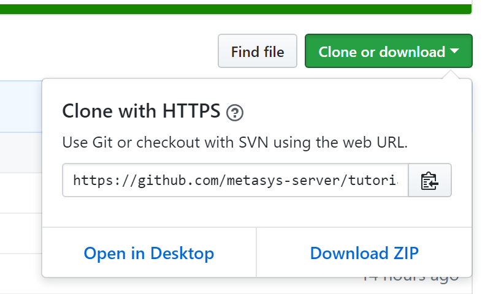

# Tutorial for C#

All of the lessons in this repository take advantage of the latest version of .Net

You can run the examples directly from the command line using `dotnet` command, or
in Visual Studio.

## Installing Prequisites

You will need

* .NET Core 2.1
* A Text Editor (optional)
* Git (optional)

### .NET Core

All of the tutorials assume you are going to run the apps using .Net Core so this is the recommend approach.

Follow the [.NET Core Guide](https://docs.microsoft.com/en-us/dotnet/core/) from Microsoft to download .NET Core 2.1
and see how to create your first app.

### Text Editor

You can use what ever text editor you want if you are simply going to be reading the code.

If you plan to edit or debug the code, it is recommend you install [Visual
Studio Code](https://code.visualstudio.com/). Then follow the [Working with C# Guide](https://code.visualstudio.com/docs/languages/csharp) by 
Microsoft. It explains how to get started with C# in Visual Studio Code.

If you already have a recent version of Visual Studio you can use that as well.

### Git Client

Seting up git is outside the scope of this tutorial. There are lots of great resources 
at the [Git](https://git-scm.com/) website including downloads and documentation.

Git isn't required to follow along so you can skip it if you wish.

## Following Along with Tutorials

If you wish you can just browse the tutorials in your browser. Simply click on the folders
for each lesson. Each of them includes a Program.cs file with code and a README that explains
the code. 

However, it is recommended that you download the repository. When you do that you can
run each program, debug each one, and even modify it to explore the API.

### Getting Code With Git

If you have git installed simply clone the repository. Open a command prompt,
change directory to a convenient location to store code and issue the clone command.

```bash
git clone https://github.com/metasys-server/tutorial-csharp.git
```

### Download an Archive of the Code

GitHub allows you to download a zip file containing a snapshot of current file.
The archive for this repo is found at <https://github.com/metasys-server/tutorial-csharp/archive/master.zip>.

You can also click the Clone or download button, and then the Download Zip button.



Then you can unzip the archive and browse the code and tutorials.

## Running The Programs

Each program can be run exactly the same way using the `dotnet run` command.
Each program requires that you supply a usernmae, password and hostname for your
Metasys server.

To run them open a console. Change directory to a lesson and type the following

```bash
dotnet run username password hostname
```

## Troubleshooting

* Self signed certificatess. If you client computer doesn't trust the certificate on your Metasys server the program will fail to run. You'll see an exception similar to the following:

      Unhandled Exception: System.Net.Http.HttpRequestException: The SSL connection could not be established, see inner exception. ---> System.Security.Authentication.AuthenticationException: The remote certificate is invalid according to the validation procedure'

    To fix this issue you must obtain a copy of the certificate from the server and import into your trusted certifidate store.
    
    * There are various ways of getting a copy of the certificate. Follow the steps at this stackoverflow question: <https://superuser.com/questions/97201/how-to-save-a-remote-server-ssl-certificate-locally-as-a-filej/> (*Note: It is you responsibility to verify the certificate before marking it as trusted. Consult your Metasys administrator if you have questions about the validity of your certificate.*)
    * Mark them as trusted in your OS. On a windows client computer you can following the instructions in *Appendix: Certificate Management* of <http://cgproducts.johnsoncontrols.com/MET_PDF/12011279.pdf/>. See the section entitled *Importing Root and Intermediate Certificates*
