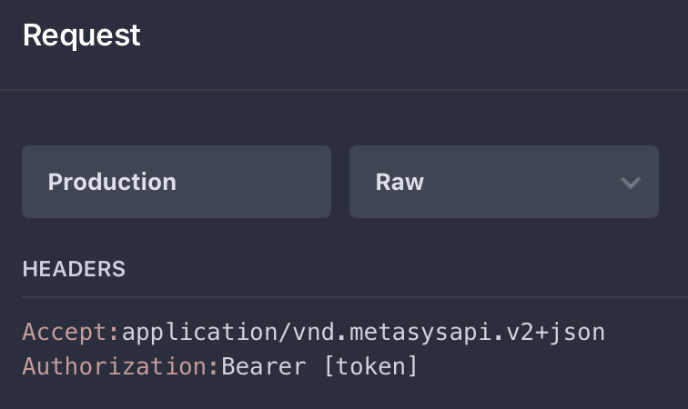

# Lesson 1

In this lesson we show you how to login and get an access token. Then we'll use
that token to retrieve a page of alarms and print the first one.

Dependencies:

* .Net Core
* [Netwonsoft's Json.NET](https://www.newtonsoft.com/json)

The dependencies will be installed for you when you run the example.

Make sure you change your current directory to lesson 1 and
then run it. You should pass your username, your password, and
your hostname as shown.

You should see something like the following:

```bash
$ dotnet run myname mypassword myhostname
The login request payload: { 'username': 'myname', 'password': 'mypassword' }
Your accessToken was successfully retrieved. Remember to always protect your access tokens.
First alarm: {
  "self": "https://adx01/api/alarms/ce480de8-9e75-4525-a6a7-b163ec898ced",
  "id": "ce480de8-9e75-4525-a6a7-b163ec898ced",
  "itemReference": "ADX01:NAE1/FC-B.VMA-12.ZN-T",
  "name": "ZN-T",
  "message": "",
  "isAckRequired": false,
  "typeUrl": "https://adx01/api/enumSets/108/members/0",
  "priority": 200,
  "triggerValue": {
    "value": "71.2",
    "unitsUrl": "https://adx01/api/enumSets/507/members/64"
  },
  "creationTime": "2019-03-26T04:07:33Z",
  "isAcknowledged": false,
  "isDiscarded": false,
  "categoryUrl": "https://adx01/api/enumSets/33/members/5",
  "objectUrl": "https://adx01/api/objects/1c031654-9fc2-5648-883c-d202cb3bdc7d",
  "annotationsUrl": "https://adx01/api/alarms/ce480de8-9e75-4525-a6a7-b163ec898ced/annotations"
}
```

The code for this program is all in one file [Program.cs](./Program.cs)

## Parse the command line arguments

The first thing we do is just parse the command line arguments:

```csharp
var username = args[0];
var password = args[1];
var hostname = args[2];
```

## Create HttpClient

Next we create an HttpClient

```csharp
using (var client = new HttpClient {BaseAddress = new Uri($"https://{hostname}/api/v2")})
{
    ...
}
```

The key thing is that we set the BaseAddress appropriately given
the hostname.

## Login

In this section we'll see how to construct a login request, send it to the server
and then retrieve the access token from the server's response.

If you look at the [documentation](https://metasys-server.github.io/api-landing/api/v2/#/reference/authentication/login/login) for
the login API you see that we need to construct a JSON payload that looks like the following:

```json
{
    "username": "the user name",
    "password": "the password"
}
```

The following code fragment achieves this:

```csharp
// Construct the payload for login
var loginMessage = $"{{ 'username': '{username}', 'password': '{password}' }}";
```

We take advantage of [string interpolation](https://docs.microsoft.com/en-us/dotnet/csharp/tutorials/string-interpolation) to
make it easier to format this string. (The double braces at the beginning and end
of the string are necessary. That is how we specify we actually want a brace `{` or `}`
in our string when using string interpolation.)

You'll note that we were able to use single quotes `'` instead of
double quotes `"` around `username`, `password` and their respective values.

Next we create an instance of `StringContent` and set the `Content-Type` to `application/json`.

```csharp
// Create an instance of StringContent (which is a subclass of HttpContent
// which is what PostAsync needs below.)
var loginContent = new StringContent(loginMessage, Encoding.UTF8, "application/json");
```

We then use the `PostAsync` method to send this content to the server. Note we only pass the uri
fragment `login` instead of a full URL. This is because we already set the base url above
when we created the HttpClient.
Also note we use the `await` keyword. This is because `PostAsync` is an asynchronous method.

```csharp
var loginResponseMessage = await client.PostAsync("login", loginContent);

```

The result of this call is an HttpResponseMessage. If everything went okay we should be able to read the response. Here we read it into a `string`.

```csharp
var loginResult = await loginResponseMessage.Content.ReadAsStringAsync();
```

The login result should be a string that look likes the following

```json
{
    "accessToken":"eyJ0eXAiOiJKV1QiLCJhbGciOiJSUzI1N...",
    "expires":"2018-10-24T18:27:56Z"
}
```

(The `accessToken` was truncated in the above example for formatting reasons; and also because you don't want to leak access tokens.)

We want to get that access token. To do that we could use string methods, but it's much easier to use a
JSON library like Newtonsoft. Therefore, we use `JToken.Parse`. The following line parses the JSON,
accesses the property named `accessToken` and converts that to a string.

```csharp
var accessToken = JToken.Parse(loginResult)["accessToken"].Value<string>();
```

## Set the Authorization Header for future requests

Every other request we make needs the access token in an Authorization header. This is documented
on every call. See [Get Alarms](https://metasys-server.github.io/api-landing/api/v2/#/reference/alarms/get-alarms/get-alarms) for an example.
If you look in the right hand pane and scroll down a bit you'll see the Headers:



The Accept header is optional as explained in the [versioning section](https://metasys-server.github.io/api-landing/api/v1/#/introduction/api-version/api-version-notes). We are choosing to use the URL
to specify version.

The Authorization header is not optional. It must be on every request.

So we set this header as follows:

```csharp
client.DefaultRequestHeaders.Authorization = AuthenticationHeaderValue.Parse($"Bearer {accessToken}");```
```

## Make Another Call

Finally we use the token we just retrieved to make another call:

```csharp
var alarmsResponse = await client.GetAsync("alarms");
```

Notice it's much easier to make a GET call then a POST. We didn't need to format any request. We just need
the URL fragment of the endpoint we want to call. In this case `alarms`.

Assuming there were no problems with the previous call we can use `JObject` to parse the
string content of the response. Then we can access the `"items"` property on the object
which contains a list of alarms. Finally we access the first one (if the list is not empty)
and print it.

```csharp
var alarmsObject = JObject.Parse(await alarmsResponse.Content.ReadAsStringAsync());
var alarms = alarmsObject["items"];
Console.WriteLine($"First alarm: {alarms?[0]}");
```
